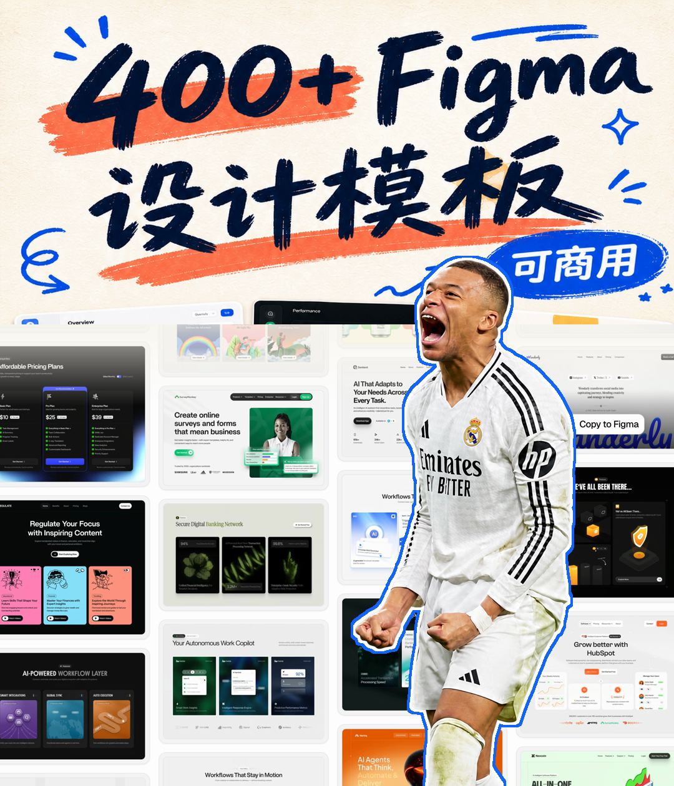

# Thumbnail Skill

English | [简体中文](README.md)

A Codex skill for designing, adapting, and reviewing social-media thumbnails with the user's real portraits, products, and screenshots. It includes working presets for Xiaohongshu, WeChat Channels, YouTube, YouTube Shorts, and Douyin.

> Current version: `v0.2.1`. The first real finished cover is included as a style demonstration. Rights for third-party people, brands, and interface imagery are not established, so the example is not presented as commercially cleared.

## What it does

- Supports five platform/content presets across horizontal and vertical layouts.
- Separates exact-use assets, style-only references, and generatable decoration.
- Prevents AI redraws or substitutions of real screenshots, products, logos, data, and people.
- Covers headline zones, real UI collages, portrait cutouts, and white-to-transparent title transitions.
- Includes QA guidance for fidelity, rights language, feed-size readability, dimensions, and export.
- Includes dependency-free Python helpers for presets and PNG/JPEG dimension checks.
- Includes ten reusable style IDs, bilingual copy-ready prompts, and a prompt builder.

## Thumbnail examples

See the full [style catalog](create-social-thumbnails/references/style-catalog.md) and the copy-ready [English prompt library](PROMPTS_EN.md).

| ID | Preview | Style | Best for |
|---|---|---|---|
| `S01` | <a href="demos/S01-warm-handwritten-collage-6x7/preview.png"></a> | Warm Handwritten Collage | Resource packs, templates, design collections |
| `S02` | Coming soon | Face-led High CTR | Personal brands, tutorials, reactions |
| `S03` | Coming soon | Clean UI Showcase | SaaS, apps, Figma, workflows |
| `S04` | Coming soon | Dark Tech Neon | AI, coding, automation, fintech |
| `S05` | Coming soon | Bold Number List | Collections, rankings, comparisons |
| `S06` | Coming soon | Before–After Split | Redesigns, transformations, tests |
| `S07` | Coming soon | News Commentary | News, analysis, explainers |
| `S08` | Coming soon | Premium Editorial | Brands, interviews, thought leadership |
| `S09` | Coming soon | Playful Sticker | Lifestyle, education, creator tips |
| `S10` | Coming soon | Product Hero | Launches, reviews, e-commerce |

The existing Figma-template cover is classified as **`S01 Warm Handwritten Collage` as the primary style, with `S02 Face-led High CTR` as a secondary trait**. It uses `S01` as its main ID because the defining system is ivory paper, marker typography, coral/blue strokes, a real interface collage, and a title gradient; the person strengthens the click driver without defining the base layout. See the [full demo notes](demos/S01-warm-handwritten-collage-6x7/README.md).

To use one, specify something like “`S01 + 6:7`” or “`S02 + 16:9`,” then replace the title and attach the real assets.

## Platform presets

| Platform | Default canvas | Ratio | Note |
|---|---:|---:|---|
| Xiaohongshu | 1080 × 1440 | 3:4 | Common image-note working preset |
| WeChat Channels | 1080 × 1260 | 6:7 | Common feed-cover working preset |
| YouTube | 3840 × 2160 | 16:9 | Current official recommendation |
| YouTube Shorts | 2160 × 3840 | 9:16 | Current official recommendation |
| Douyin | 1080 × 1920 | 9:16 | Common vertical working preset |

Platform interfaces change. The Xiaohongshu, WeChat Channels, and Douyin dimensions are practical project presets, so check the current in-app crop preview before publishing. The YouTube values follow [YouTube Help](https://support.google.com/youtube/answer/72431?hl=en).

### Ratio-only presets

You can also generate a cover by ratio without naming a platform:

| Ratio | Default canvas | Typical use |
|---:|---:|---|
| `1:1` | 1080 × 1080 | Square social cover |
| `4:3` | 1600 × 1200 | Landscape presentation or classic video cover |
| `3:4` | 1080 × 1440 | Portrait social cover |
| `4:5` | 1080 × 1350 | Portrait feed cover |
| `6:7` | 1080 × 1260 | WeChat Channels-style portrait cover |
| `16:9` | 1920 × 1080 | General landscape video cover |
| `9:16` | 1080 × 1920 | Full-height vertical video cover |

## Installation

The skill requires a Codex version with Agent Skills support. The three helper scripts require Python 3.10 or newer and have no third-party Python dependencies.

### Option 1: Ask Codex to install it (recommended)

Enter this in Codex:

```text
$skill-installer install the create-social-thumbnails skill from https://github.com/anxiong2025/thumbnail-skill/tree/main/create-social-thumbnails
```

Codex normally detects a newly installed skill automatically. Restart Codex if it does not appear.

### Option 2: User-level installation

```bash
git clone https://github.com/anxiong2025/thumbnail-skill.git
mkdir -p ~/.agents/skills
cp -R thumbnail-skill/create-social-thumbnails ~/.agents/skills/
```

A user-level skill is available across local projects for that user.

### Option 3: Repository-level installation

Run this from the target repository root:

```bash
mkdir -p .agents/skills
cp -R /path/to/thumbnail-skill/create-social-thumbnails .agents/skills/
```

Commit `.agents/skills/create-social-thumbnails` when the whole team should use it in that repository. These locations follow the [official OpenAI skill documentation](https://learn.chatgpt.com/docs/build-skills).

## Usage

Invoke the skill explicitly in Codex:

```text
$create-social-thumbnails
Create a 6:7 WeChat Channels cover from my real portrait and product screenshots.
Title: 400+ Figma Design Templates
Supporting label: Commercial-use assets
Style: warm ivory and hand-drawn; place a white-to-transparent gradient between the title and the real collage.
Do not generate or redraw the product screenshots, and do not change the person's identity.
```

You can also describe the task normally. Codex may select the skill automatically when the request matches its description.

For a quick starting point, open [PROMPTS_EN.md](PROMPTS_EN.md), choose `S01–S10`, and replace the braced title, ratio, and asset fields.

### Recommended inputs

- target platform and content type;
- main title and optional supporting text;
- real photos, screenshots, products, or logos that must remain authentic;
- style-only references;
- brand colors, tone, and desired output format;
- whether the assets are cleared for public or commercial use.

### More examples

```text
$create-social-thumbnails Use this real portrait and these three real UI screenshots to create two 3:4 Xiaohongshu variants: one text-led and one face-led.
```

```text
$create-social-thumbnails Adapt this WeChat Channels cover to 16:9 YouTube. Preserve the real person and screenshots, rebuild the hierarchy, and do not stretch the original.
```

```text
$create-social-thumbnails Review this Douyin cover for feed-size readability, safe margins, cutout fidelity, real-asset integrity, and commercial-rights wording. Give recommendations only.
```

## Helper scripts

Inspect presets:

```bash
python3 create-social-thumbnails/scripts/platform_presets.py --list
python3 create-social-thumbnails/scripts/platform_presets.py --list-ratios
python3 create-social-thumbnails/scripts/platform_presets.py --ratio 4:3 --json
python3 create-social-thumbnails/scripts/platform_presets.py --platform wechat --json
```

Build an editable prompt:

```bash
python3 create-social-thumbnails/scripts/prompt_builder.py --list-styles --language en
python3 create-social-thumbnails/scripts/prompt_builder.py --style S01 --ratio 16:9 --title "400+ Figma Design Templates" --platform YouTube --language en
```

Verify a PNG or JPEG export:

```bash
python3 create-social-thumbnails/scripts/verify_thumbnail.py cover.png --platform wechat-channels
python3 create-social-thumbnails/scripts/verify_thumbnail.py cover.png --ratio 4:3
python3 create-social-thumbnails/scripts/verify_thumbnail.py cover.jpg --platform youtube --aspect-only
```

The scripts verify technical properties only. They do not replace visual, factual, or rights review.

## Repository structure

```text
thumbnail-skill/
├── README.md
├── README_EN.md
├── PROMPTS.md
├── PROMPTS_EN.md
├── LICENSE
├── demos/
│   └── README.md
└── create-social-thumbnails/
    ├── SKILL.md
    ├── agents/openai.yaml
    ├── assets/README.md
    ├── references/
    │   ├── asset-integrity.md
    │   ├── composition-patterns.md
    │   ├── platform-specs.md
    │   ├── qa-checklist.md
    │   └── style-catalog.md
    └── scripts/
        ├── platform_presets.py
        ├── prompt_builder.py
        └── verify_thumbnail.py
```

## Demo policy

Future examples belong in [`demos/`](demos/). Each demo must include its platform, dimensions, inputs, output, reproduction steps, and `LICENSE-ASSETS.md`. Public demos should prefer owned or licensed assets. If the repository owner explicitly includes a rights-unverified style example, it must be labeled separately, excluded from the MIT License, and never presented as commercially cleared.

## License and commercial-use notice

The repository's code and written workflow are released under the [MIT License](LICENSE). The MIT License does **not** automatically cover demo images, user-uploaded photos, likeness rights, brand logos, software screenshots, fonts, third-party templates, or assets produced by external services.

Only call a finished thumbnail “commercially cleared” when the rights for every included asset are documented. This repository provides a production SOP and validation mechanism, not legal advice.

## Contributing

Issues and pull requests are welcome. For a new platform preset, include its source and verification date. For a new demo, document the asset rights first and remove personal information.
